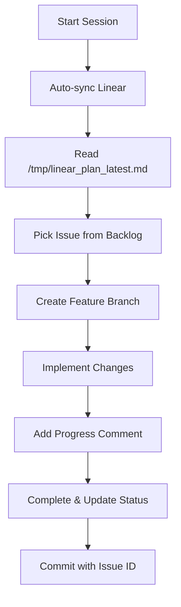

# Linear Integration Guide

Complete guide for using Linear as the single source of truth for planning with Claude Code.

## Overview

This integration solves the "lost context" problem by using Linear as persistent storage for project plans. All agents can query Linear to get the current state, work on specific issues, and update progress.

## Components

### 1. Linear Client CLI (`linear_client.py`)

Full-featured CLI for interacting with Linear.

**Commands:**
```bash
# Export plan as markdown
python3 linear_client.py export-md

# Export plan as JSON
python3 linear_client.py export-json --output plan.json

# List all issues with details
python3 linear_client.py list-issues

# Update issue status
python3 linear_client.py update-status \
  --issue-id <issue-id> \
  --state-id <state-id>

# Add comment to issue
python3 linear_client.py add-comment \
  --issue-id <issue-id> \
  --comment "Implemented feature X"
```

**Options:**
- `--team` - Team name (default: Agent-Control-Plane)
- `--project` - Project name (default: MVP 1 — PT App & Agent Pilot)
- `--output` - Output file path

### 2. MCP Server (`mcp_server.py`)

MCP server that provides Linear tools directly in Claude Code.

**Available Tools:**
- `linear_get_plan` - Fetch complete project plan
- `linear_list_issues` - List all issues
- `linear_get_issue` - Get detailed issue info
- `linear_update_status` - Update issue status
- `linear_add_comment` - Add progress comments
- `linear_get_workflow_states` - Get available states

**Setup:**
```bash
# Add to your Claude Code MCP config (~/.config/claude/mcp.json)
{
  "mcpServers": {
    "linear-integration": {
      "command": "python3",
      "args": ["/Users/expo/Code/expo/clients/linear-bootstrap/mcp_server.py"],
      "env": {
        "LINEAR_API_KEY": "lin_api_..."
      }
    }
  }
}
```

### 3. Slash Command (`/sync-linear`)

On-demand plan sync.

**Usage:**
```
/sync-linear
```

This will:
1. Fetch the latest plan from Linear
2. Display all issues with current status
3. Suggest next steps based on priorities

### 4. Auto-Sync Hook (`on-start.sh`)

Automatically syncs plan when Claude Code starts.

**Location:** `.claude/hooks/on-start.sh`

**What it does:**
- Runs at session start
- Fetches latest plan from Linear
- Saves to `/tmp/linear_plan_latest.md`
- Displays summary in terminal

**Enable:**
```bash
# Hook should be automatically enabled if in .claude/hooks/
# Ensure it's executable:
chmod +x .claude/hooks/on-start.sh
```

## Workflow

### Single Agent Workflow



**Example:**
```bash
# 1. Session starts - auto-sync runs
# Plan saved to /tmp/linear_plan_latest.md

# 2. Claude reads the plan
Read /tmp/linear_plan_latest.md

# 3. Pick an issue (e.g., ACP-5: Define Supabase Schema)
# Create branch
git checkout -b feature/acp-5-supabase-schema

# 4. Work on implementation
# ... make changes ...

# 5. Update Linear
python3 linear_client.py add-comment \
  --issue-id "d8364373-a751-4f79-91b3-65d04d81fd23" \
  --comment "Implemented user authentication schema"

# 6. Mark complete (get state ID first)
python3 linear_client.py update-status \
  --issue-id "d8364373-a751-4f79-91b3-65d04d81fd23" \
  --state-id "<done-state-id>"

# 7. Commit with issue reference
git commit -m "ACP-5: Define Supabase schema for PT app"
```

### Multi-Agent Workflow

Different agents can work on different issues simultaneously:

**Agent 1 (Data Layer):**
```bash
# Works on zone-7, zone-8 issues
# Picks: ACP-5 (Define Supabase Schema)
git checkout -b feature/acp-5-supabase-schema
# ... implements schema ...
# Updates Linear: ACP-5 → In Progress → Done
```

**Agent 2 (Mobile):**
```bash
# Works on zone-12 issues
# Picks: ACP-6 (Scaffold iOS SwiftUI App)
git checkout -b feature/acp-6-ios-scaffold
# ... scaffolds iOS app ...
# Updates Linear: ACP-6 → In Progress → Done
```

**Agent 3 (Backend):**
```bash
# Works on zone-3c issues
# Picks: ACP-7 (PT Agent Service Backend)
git checkout -b feature/acp-7-backend-skeleton
# ... creates backend service ...
# Updates Linear: ACP-7 → In Progress → Done
```

**Coordination:**
- Each agent checks Linear at start → sees full plan
- Agents pick issues based on zone labels
- Linear shows real-time status of all issues
- No conflicts - different issues, different branches
- Human reviews progress in Linear UI

## Best Practices

### 1. Always Check Linear First

```bash
# At session start
/sync-linear

# Or use MCP tool
linear_get_plan
```

### 2. Use Issue IDs in Git Commits

```bash
git commit -m "ACP-5: Implement user schema"
git commit -m "ACP-6: Add SwiftUI navigation structure"
```

### 3. Update Linear as You Work

```bash
# When starting
linear_update_status --issue-id <id> --state-id <in-progress-id>

# Progress updates
linear_add_comment --issue-id <id> --comment "Completed X, working on Y"

# When done
linear_update_status --issue-id <id> --state-id <done-id>
```

### 4. Use Labels for Agent Routing

Issues are labeled with zones:
- `zone-7`, `zone-8` → Data layer
- `zone-12` → Mobile/presentation
- `zone-3c` → Cognitive/agent layer

Agents should filter by relevant labels.

### 5. Human Approval in Linear

Before agent starts work:
1. Human creates/prioritizes issues in Linear
2. Adds descriptions, acceptance criteria
3. Assigns labels for routing
4. Agent syncs and picks from approved backlog

## Troubleshooting

### "LINEAR_API_KEY not set"

```bash
export LINEAR_API_KEY=lin_api_...
# Or add to ~/.bashrc or ~/.zshrc
```

### "Team/Project not found"

Check names match exactly:
```bash
python3 linear_client.py list-issues --team "Agent-Control-Plane"
```

### Hook not running

```bash
# Ensure executable
chmod +x .claude/hooks/on-start.sh

# Check hooks are enabled in Claude Code settings
```

### MCP server not available

1. Check `~/.config/claude/mcp.json` has correct path
2. Ensure `LINEAR_API_KEY` in env section
3. Restart Claude Code

## Advanced Usage

### Custom Plan Queries

```python
from linear_client import LinearClient

async with LinearClient(api_key) as client:
    # Get specific issue
    issue = await client.get_issue_by_id("issue-id")

    # Get workflow states
    states = await client.get_workflow_states(team_id)

    # Update description
    await client.update_issue_description(issue_id, "New description")
```

### Filtering Issues by Label

```bash
# Export plan, then filter with jq
python3 linear_client.py export-json | \
  jq '.issues[] | select(.labels.nodes[].name | contains("zone-7"))'
```

### Automated Status Updates

Create a script that updates Linear based on git events:

```bash
#!/bin/bash
# .git/hooks/post-commit

# Extract issue ID from commit message
ISSUE_ID=$(git log -1 --pretty=%B | grep -oE 'ACP-[0-9]+')

if [ -n "$ISSUE_ID" ]; then
  python3 linear_client.py add-comment \
    --issue-id "$ISSUE_ID" \
    --comment "Commit: $(git rev-parse --short HEAD)"
fi
```

## Migration from Markdown Plans

If you have existing markdown plans:

1. Create issues in Linear for each task
2. Add zone labels for routing
3. Copy descriptions/acceptance criteria
4. Delete local markdown files
5. Use Linear as single source of truth

## FAQ

**Q: Can multiple agents work on the same issue?**
A: Technically yes, but not recommended. Use Linear to coordinate - if one agent marks an issue "In Progress", others should pick different issues.

**Q: What if Linear API is down?**
A: Keep a local cache of the last synced plan in `/tmp/linear_plan_latest.md` as fallback.

**Q: How do I add new issues during work?**
A: Either create them directly in Linear UI, or extend the bootstrap script with `create_issue` function.

**Q: Can I use this with other projects?**
A: Yes! Just change `--team` and `--project` parameters. You can manage multiple projects.

**Q: What about private/sensitive plans?**
A: Linear has access controls. Use team permissions and private projects as needed.

## Next Steps

1. ✅ Install dependencies: `pip install -r requirements.txt`
2. ✅ Set LINEAR_API_KEY environment variable
3. ✅ Run initial sync: `/sync-linear`
4. ✅ Configure MCP server (optional)
5. ✅ Enable on-start hook (optional)
6. ✅ Start building!

## Support

- Linear API Docs: https://developers.linear.app/docs
- GraphQL Explorer: https://studio.apollographql.com/public/Linear-API/variant/current/home
- Issues: Create in Linear or GitHub
